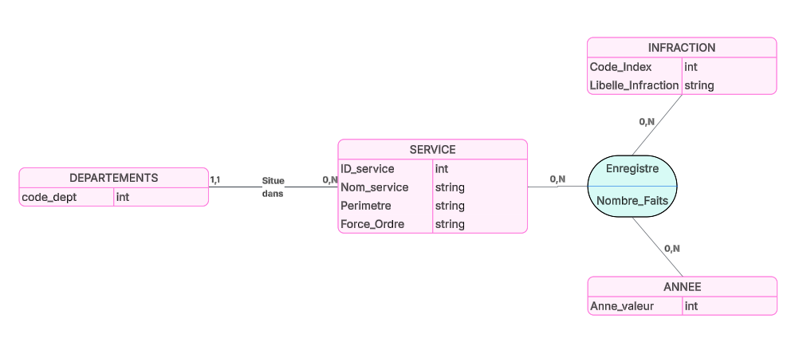
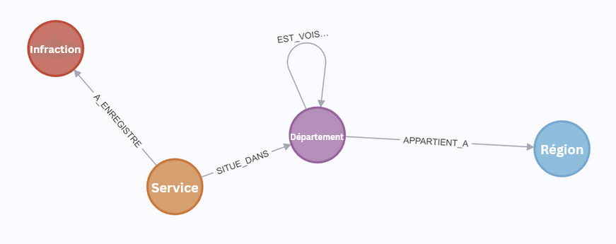
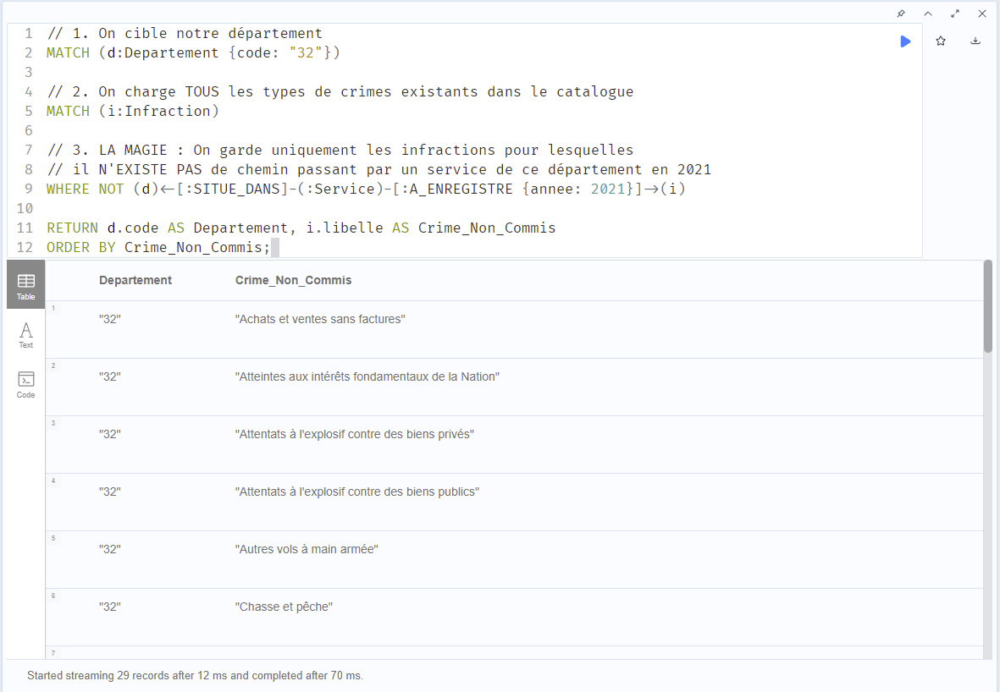

---
output:
  word_document: default
  html_document: default
  pdf_document: default
---

# Groupe 5 Wouters Jade RAHMANI Ibrahim
# SAE 5.02 Migration de données vers ou depuis environnemment NoSQL

## [lien de la vidéo youtube :](https://youtu.be/4bm0z81G_Yg)
### https://youtu.be/4bm0z81G_Yg

## [Lien vers le dépot GitHub](https://github.com/SKTWIR/SA-5.02-Migration-de-donn-es-vers-ou-depuis-un-environnement-NoSQL-)
## https://github.com/SKTWIR/SA-5.02-Migration-de-donn-es-vers-ou-depuis-un-environnement-NoSQL-

<center> Rapport final </center>

# Sommaire

I - [Étude des données et identification des entités et relations clés](#i---étude-des-données-et-identification-des-entités-et-relations-clés)

* [1. Analyse de la structure initiale](#1-analyse-de-la-structure-initiale-les-données-brutes)
* [2. Identification des Entités](#2-identification-des-entités-concepts-métiers-indépendants)
* [3. Identification des Relations et de la Table de Faits](#3-identification-des-relations-et-de-la-table-de-faits)
* [Conclusion études conceptuelles](#conclusion-de-létude-conceptuelle)
 
II - [MCD et MDL](#ii---mcd-et-mdl)
* [1. MCD](#1-mcd)
* [2. MLD](#2-mld)

III - [Analyse des limites du modèle relationnel](#iii---analyse-des-limites-du-modèle-relationnel)
* [1. Performances](#1-performances)
* [2. Lisibilité](#2-lisibilité)
* [3. Requêtes complexes](#3-requêtes-complexes)

IV - [Le modèle graphe](#iv---le-modèle-graphe)
* [1. proposition du modèle](#1-proposition-du-modèle)
* [2. Justification du choix de transformation](#2-justification-des-choix-de-transformation)

V - [Comparaison des performances entre les bases relationnelles et graphes](#v---comparaison-des-performances)

VI - [Les différentes méthode de migrations qui existent](#vi---les-différentes-méthodes-de-migration-sql-vers-graphe)

VII - [Description des travaux](#vii---description-des-travaux)
* [1. Choix technologique et stratégie](#1-choix-technologique-et-stratégie)
* [2. La migration](#2-la-migration)


VIII - [Ajout de nouvelles données](#vii---lajout-de-nouvelles-données--ladjacence-des-communesdépartements)


# I - Étude des données et identification des entités et relations clés

L’objectif premier de cette phase a été d'analyser la structure des données brutes (fichiers Excel/CSV fournis par le Ministère de l'Intérieur) afin de concevoir un modèle relationnel normalisé, exempt de redondances et optimisé pour l'interrogation.
## 1. Analyse de la structure initiale (Les données brutes)

L'étude des fichiers sources a révélé une structure en "tableau croisé" (format Wide), conçue pour la lecture humaine mais inadaptée à un Système de Gestion de Base de Données (SGBD).
Les lignes définissaient les types d’infractions (via la nomenclature de l'État 4001, avec un index et un libellé).
Les colonnes et leurs en-têtes imbriqués sur trois niveaux définissaient l'organisation géographique et administrative : l'année, le département, le périmètre (ex: DCSP, DCCRS) et le nom du service (ex: Commissariat ou Brigade).

Les valeurs à l'intersection représentaient le volume (le nombre de faits constatés).

## 2. Identification des Entités (Concepts métiers indépendants)

Pour passer de cette matrice à un Modèle Conceptuel de Données (MCD), nous avons appliqué les règles de normalisation pour isoler les concepts "autonomes". Nous avons identifié trois entités dimensionnelles principales :
 ### L'entité INFRACTION : 
   * Elle représente le "Quoi". Elle est structurée autour d'un identifiant naturel fort (l'Index 4001, allant de 1 à 107) et d'une description textuelle (le libellé du crime ou délit).

### L'entité SERVICE : 
   * Elle représente le "Qui". Chaque colonne de nos fichiers correspondait à un point d'enregistrement (une brigade de Gendarmerie ou un commissariat de Police). Cette entité possède ses propres attributs : son nom, son périmètre administratif et son appartenance (Force de l'ordre : PN ou GN).

### L'entité DÉPARTEMENT : 
   * Elle représente le "Où". Bien qu'elle n'ait qu'un code dans les données initiales, c'est une entité géographique à part entière qui a vocation à être enrichie ultérieurement (notamment via des données publiques lors du passage au modèle Graphe).

## 3. Identification des Relations et de la Table de Faits

Une fois les entités définies, il a fallu établir comment elles interagissaient pour former l'information finale (le nombre de crimes/délits).

### Relation structurelle (SITUE_DANS) : 
   * L'analyse a montré qu'un service appartient de manière stricte à une zone géographique. Nous avons donc identifié une relation (1,1) entre SERVICE et DÉPARTEMENT. Dans le modèle logique, cela se traduit par la présence de la clé étrangère code_dept dans la table des Services.

### Relation événementielle / Table de Faits (ENREGISTRE) : 
   * L'information centrale (le "nombre de faits") n'appartient ni à un service seul, ni à une infraction seule, mais résulte du croisement entre un SERVICE, une INFRACTION et une ANNÉE spécifique. Nous avons donc identifié une association ternaire. Dans notre modèle logique relationnel, elle prend la forme d'une table de faits que nous avons nommée Fait_Statistique. Sa clé primaire est composite (ID_Service + Code_Index + Annee), garantissant l'unicité de chaque relevé statistique.

## Conclusion de l'étude conceptuelle

Ce raisonnement analytique nous a permis de concevoir une architecture en "schéma en étoile". Ce modèle relationnel normalisé en 3NF (Troisième Forme Normale) assure l'intégrité des données historiques (2012-2021) tout en préparant naturellement le terrain pour la Phase 3 : en effet, les entités identifiées deviendront les Nœuds (Nodes) de notre future base de données orientée graphe (Neo4j), et les associations deviendront nos Relations (Edges).


# II - MCD et MDL

## 1. MCD
Le MCD permet de visualiser les entités métiers et leurs relations. Nous avons identifié 4 entités principales et 2 associations.

## Les Entités :

   ### DEPARTEMENT : Représente la zone géographique.

        <u>Code_Dept</u> (Identifiant)

   ### SERVICE : Représente le commissariat ou la brigade (ex: CSP BOURG EN BRESSE).

        <u>ID_Service</u> (Identifiant généré)

        Nom_Service

        Perimetre (ex: DCSP, DCCRS)

        Force_Ordre (PN ou GN)

   ### INFRACTION : Le catalogue de l'État 4001 (les 107 types de crimes/délits).

        <u>Code_Index</u> (Identifiant)

        Libelle_Infraction

   ### ANNEE : La dimension temporelle.

        <u>Annee_Valeur</u> (Identifiant)

## Les Associations :

   ### SITUE_DANS : Relie SERVICE (1,1) à DEPARTEMENT (0,n).

    Lecture : Un service est situé dans un et un seul département. Un département contient zéro ou plusieurs services.

   ### ENREGISTRE : Association ternaire (ou table de faits) reliant SERVICE (0,n), INFRACTION (0,n) et ANNEE (0,n).

    Propriété portée par l'association : Nombre_Faits (l'indicateur quantitatif).

    Lecture : Un service enregistre, pour une infraction donnée et une année donnée, un certain nombre de faits.

### **Schéma du MCD :**



## 2. MLD
Le MLD est la traduction du MCD en tables relationnelles (avec clés primaires soulignées et clés étrangères précédées d'un # ou en italique).

  ### -  Departement (<u>code_dept</u>)

  ### - Service (<u>id_service</u>, nom_service, perimetre, force_ordre, #code_dept)

  ### -  Infraction (<u>code_index</u>, libelle_infraction)
  
  ### - Fait_Statistique (#id_service, #code_index, #annee_valeur, nombre_faits)

    Note : La clé primaire de cette table est composite, elle est formée par la réunion des trois clés étrangères.


# III - Analyse des limites du modèle relationnel

Bien que le modèle relationnel (SQL) soit robuste pour garantir l'intégrité des données, il révèle des limites structurelles importantes lorsqu'il s'agit d'exploiter des données fortement interconnectées (comme ici la criminalité).

## 1. Performances
Dans notre modèle relationnel, l'information est volontairement fragmentée en plusieurs tables (Service, Infraction, Departement, Fait_Statistique) pour éviter la redondance.

Pour répondre à une question analytique (ex. : « Quel est le volume de cambriolages enregistrés par les commissariats d'un département donné sur 5 ans ? »), le moteur SQL doit croiser ces différentes tables. Ce processus implique de réaliser des jointures massives. Cependant, avec des millions de relevés statistiques, la multiplication des jointures provoque une chute importantes des performances.

## 2. Lisibilité

La transformation du modèle conceptuel (MCD) en modèle logique (MLD) introduit des éléments purement techniques qui éloignent la base de données de la réalité métier. Avec le modèle relationnel l'ajout de tables noie les utilisateurs sous  de nombreuses clés étrangères, il n'est pas facile de comprendre ce modèle d'un point de vue extérieur et cela perd son sens pour une question métier.

Il est également complexe de modifié le schéma en cas de besoin d'évolution. Ce modèle impose un schéma strict dit "Schema-on-write". Ajouter une nouvelle dimension impose une modification structurelles des tables. Dans ce genre de cas le modèle graphe lui est beaucoup plus laxiste.

## 3. Requêtes complexes

Le langage SQL est conçu pour des opérations simples (filtrer, grouper, faire des sommes etc...), mais il est plutôt inadapté pour parcourir des chemins ou analyser des données complexes.

Le plus gros problème vient de la lourdeurs du code pour faire une requête. Ce genre de requêtes peut impliquent de joindre une table sur elle-même de multiples fois. Elles sont extrêmement longues, complexes à maintenir, parfois difficiles à déboguer et très gourmandes en ressources.

À l'inverse, interroger des chemins complexes est l'essence même d'un langage de requête graphe, qui permet de le faire en une seule ligne de code lisible.


# IV - Le modèle graphe

Le passage au modèle graphe permet de passer d'un stockage orienté "lignes" à un stockage orienté "relations".

## 1. Proposition du modèle

Dans notre base Neo4j, nous transformons nos entités en Nœuds (Nodes) et nos associations en Relations (Edges).

### Définition des Nœuds :

    Infraction (Rouge) : Contient le libellé et l'index 4001.

    Service (Orange) : Contient le nom du commissariat/brigade et sa force (PN/GN).

    Département (Violet) : Représente l'échelon administratif départemental.

    Région (Bleu) : Représente l'échelon administratif supérieur (enrichissement par rapport au SQL).

### Définition des Relations :

    [:A_ENREGISTRE] : Relie un Service à une Infraction. Cette relation porte les propriétés temporelles et quantitatives (ex: {annee: 2021, nombre: 45}).

    [:SITUE_DANS] : Relie un Service à son Département.

    [:APPARTIENT_A] : Relie un Département à sa Région.

    [:EST_VOISIN_DE] : Relation réflexive reliant deux Départements limitrophes.

### Schéma visuel :



## 2. Justification des choix de transformation

Une des premières de la transformation est la suppression de la table de faits pour une lecture plus intuitive. Contrairement au SQL où la table Fait_Statistique est un pivot technique, dans le graphe, elle disparaîtet est remplacer par une relation directe [:A_ENREGISTRE]. Cela rend la lecture naturelle : "Le Service X a enregistré l'Infraction Y".

En plus de la suppression de la table des faits, en utilisant l'Adjacence sans Index (Index-Free Adjacency), Neo4j n'a pas besoin de chercher dans une table pour savoir à quelle région appartient un département ; il suit simplement le pointeur physique (la flèche [:APPARTIENT_A]).

Et enfin comme sité plus tôt dans la aprtie 3, l'ajout de la relation [:EST_VOISIN_DE] sur le nœud "Département" permet de réaliser des analyses de propagation géographique impossibles ou trop lentes en SQL.

# V - Comparaison des performances

* Approche Relationnelle (SQL) : Basée sur des Index et des Jointures. Pour calculer le volume total d'un crime sur 10 ans, le moteur SQL doit scanner des millions de lignes dans la table des faits, vérifier les clés étrangères, puis filtrer. Le temps de réponse augmente de façon exponentielle avec le volume de données.

* Approche Graphe (Cypher/Neo4j) : Basée sur l'Index-Free Adjacency (Adjacence sans index). Le moteur trouve le nœud "Cambriolage", et "marche" littéralement le long des relations qui y sont physiquement attachées. Il n'y a pas de jointure globale à calculer. Le temps de requête reste constant et ultra-rapide (quelques millisecondes), même avec des millions de faits enregistrés.


# VI - Les différentes méthodes de migration (SQL vers Graphe)

Dans le cadre d'une migration d'un modèle relationnel vers un modèle graphe, plusieurs approches existent. Le choix dépend du volume de données, de la fréquence de mise à jour (migration "One-shot" vs synchronisation continue) et des compétences techniques de l'équipe :

* ### Méthode 1 : L'approche ETL (Extract, Transform, Load) par script sur mesure (Celle que nous avons choisie)
    * Principe : Utilisation d'un langage de programmation (ex: Python avec Pandas et le driver officiel Neo4j) pour extraire les données, les nettoyer en mémoire, purger les types incompatibles, puis les injecter par "lots" (batching) via des requêtes Cypher (UNWIND).

    * Avantage : Contrôle total sur la transformation (comme la conversion d'une table de faits en relations). Idéal pour des nettoyages complexes.

* ### Méthode 2 : L'utilisation de plugins d'intégration directe (ex: Neo4j APOC)
    * Principe : La librairie APOC (Awesome Procedures On Cypher) de Neo4j permet de se connecter directement à une base SQL en direct via JDBC (apoc.load.jdbc). On écrit une requête Cypher qui va lire les tables SQL en temps réel et créer les nœuds.
    * Avantage : Pas besoin d'exporter de fichiers intermédiaires (CSV).

* ### Méthode 3 : Les outils de cartographie d'ETL visuels (Neo4j Data Importer ou Talend)
    * Principe : Utilisation d'outils avec interface graphique où l'on glisse-dépose les fichiers sources et où l'on dessine les flèches pour indiquer au logiciel comment transformer les colonnes en nœuds et relations.
    * Avantage : Ne nécessite quasiment aucune compétence en code (No-Code).

# VII - Description des travaux

Pour la migration de nos données, nous avons mis en œuvre la Méthode 1 (ETL par script Python) évoqué plus haut. Ce choix se justifie par la nécessité de transformer une structure relationnelle rigide en un modèle de graphe flexible, tout en maîtrisant la performance de l'injection.

## 1. Choix technologique et stratégie

Nous avons développé un connecteur sur mesure en Python, utilisant le driver officiel neo4j et le module sqlite3.
Nous avons décidé d'utiliser une approche par Batching (lots de 10 000 lignes). Cela permet d'éviter la saturation de la mémoire vive et d'optimiser les transactions vers Neo4j.

## 2. La migration

Le cycle de vie de la donnée pour ce projet respecte le pipeline suivant :
Excel (Source) → CSV → SQLite (Relationnel) → Neo4j (Graphe).

Le processus se déroule en quatre étapes distinctes :

### La phase de préparation (Pre-processing et Nettoyage) :
Pour commencer la SAE il nous a fallu crée un script pour transformer notre fichier Excel de données en CSV puis en .SQL exploitable. Cette étape a nécissité un pre-processing sur le fichier Excel pour simplifier la transformation en CSV. ensuite un code python a servi a transformer le CSV en base de données relationnel.

Enfin nous rentrons dans le coeur du sujet avec la création d'une base noSQL avec neo4j. Avant toute insertion en neo4j, notre script purge la base de destination pour garantir la propreté de la base. Nous créons immédiatement des contraintes unique (IS UNIQUE) sur les étiquettes Departement, Infraction et Service. Cela est important pour garantir des bonnes performances.

### Extraction et Transformation :
On extrait les entités pour les transformer en noeuds. Certains noeuds sont enrichie par des propriétés pour avoir une base de données plus propre.
Exemple : la table Service est enrichie en créant une propriété nom unique combinant le nom du service et son département pour éviter les collisions entre services homonymes de départements différents.

### Chargement des noeuds (intégration) :
Nous utilisons la clause Cypher **UNWIND**. Au lieu d'envoyer 1 000 requêtes CREATE, nous envoyons une seule liste de 1 000 dictionnaires Python que Neo4j traite comme une boucle interne ultra-rapide.

##Optimisation des données (Filtrage des valeurs null) :
Lors de cette étape, nous avons fait le choix délibéré de ne pas migrer les lignes dont le nombre de faits est égal à 0.

En SQL : Une ligne avec une valeur à 0 reste présente pour respecter la structure de la table.

En Graphe : Une relation n'existe que si l'événement a eu lieu. Ne pas créer de relations pour les valeurs nulles permet de réduire drastiquement le poids de la base de données et d'accélérer les futures requêtes de parcours (on ne garde que ce qui est significatif).

*exemple de requête pour voir les infractions à 0 :*

    
### Création des Relations :
C'est l'étape la plus importante. La table SQL Fait_Statistique est transformée en relations (A_ENREGISTRE).

On lie le Service au Departement via :SITUE_DANS.

On lie le Service à l'Infraction via :A_ENREGISTRE, en stockant l'année et le nombre de faits directement comme propriétés de la relation.


# VIII - L'ajout de nouvelles données : L'adjacence des communes/départements

Le cahier des charges demande de prévoir l'enrichissement des données avec des sources publiques (open data), notamment les adjacences géographiques (qui est voisin de qui). L'objectif est de pouvoir analyser la propagation géographique d'un type de délit. Voici comment cela se traduit dans les deux technologies :

Dans la Base de Données Relationnelle (SQL)
Pour ajouter l'adjacence, le SQL exige une modification du schéma (MCD/MLD) et la création d'une nouvelle table d'association réflexive :
```
CREATE TABLE Departement_Voisin (
    code_dept_1 VARCHAR(3),
    code_dept_2 VARCHAR(3),
    PRIMARY KEY (code_dept_1, code_dept_2),
    FOREIGN KEY (code_dept_1) REFERENCES Departement(code_dept),
    FOREIGN KEY (code_dept_2) REFERENCES Departement(code_dept)
);
```
**Inconvénient** : Pour trouver si un crime s'est propagé sur des départements voisins jusqu'à 3 niveaux de profondeur (le voisin du voisin du voisin), le SQL imposera d'écrire 3 jointures récursives (des JOIN sur la même table). C'est extrêmement coûteux en performances et illisible.

Dans la Base de Données Orientée Graphe (Neo4j)

C'est ici que le graphe brille. Aucun changement de schéma n'est requis. Si l'on dispose d'un simple fichier CSV indiquant dept_A, dept_B, il suffit d'ajouter une relation [:EST_VOISIN_DE] entre les nœuds départements existants.

```
// Exemple de requête d'ajout de l'adjacence
LOAD CSV WITH HEADERS FROM "file:///adjacences.csv" AS ligne
MATCH (d1:Departement {code: ligne.dept_A})
MATCH (d2:Departement {code: ligne.dept_B})
MERGE (d1)-[:EST_VOISIN_DE]-(d2)
```

**Avantage** : Une fois la flèche créée, répondre à la question de la "propagation" devient natif et quasi immédiat. En Cypher, on peut chercher des chemins de profondeur variable d'une simple ligne :
MATCH (s:Service)-[:A_ENREGISTRE]->(:Infraction {libelle: "Trafic de stupéfiants"})
MATCH (s)-[:SITUE_DANS]->(d1:Departement)-[:EST_VOISIN_DE*1..3]-(d2:Departement)

Ici, *1..3 demande au moteur de naviguer tout seul jusqu'aux voisins de niveau 3, chose redoutable à faire en relationnel !

